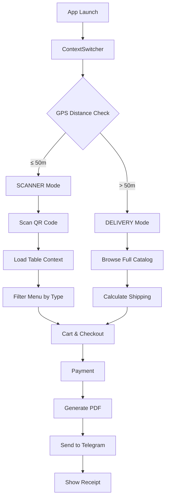

TableOrder follows a **feature-based architecture** that organizes code by domain rather than by file type. This approach keeps related functionality together, making it easier to understand, maintain, and extend.

## Design philosophy

The architecture is built around three core principles:

<CardGroup cols={3}>
  <Card title="Domain-driven" icon="folder-tree">
    Features are grouped by domain (menu, payments, notifications) rather than technical layer
  </Card>
  <Card title="Low coupling" icon="link-slash">
    Each module is self-contained with minimal dependencies on other parts of the system
  </Card>
  <Card title="High cohesion" icon="puzzle-piece">
    Related functionality lives together, making it easy to locate and modify features
  </Card>
</CardGroup>

## Directory structure

All application code lives in the `src/` directory:

```
src/
├── lib/
│   ├── core/               # App-wide singletons
│   │   ├── types.ts        # TypeScript interfaces (source of truth)
│   │   ├── mockData.ts     # Products + tables dataset
│   │   ├── config.ts       # API credentials from .env
│   │   ├── payments/       # paymentService — mock Stripe flow
│   │   ├── notifications/  # NotificationService — expo-notifications
│   │   └── sound/          # SoundService — expo-av beep
│   ├── modules/
│   │   └── menu/           # useMenuLogic — contextual filtering hook
│   └── services/           # External API integrations
│       ├── mapboxService.ts # Directions API + polyline decode + ETA
│       ├── pdfService.ts    # expo-print branded ticket generator
│       └── telegramService.ts # Bot API PDF upload
├── stores/
│   ├── useTableStore.ts    # Active table session (Zustand)
│   ├── useCartStore.ts     # Cart items, totals, discount, service type (Zustand)
│   └── useLocationStore.ts # App mode, GPS coords, delivery info (Zustand)
└── components/
    ├── scanner/            # CameraScanner with idempotency ref
    ├── location/           # ContextSwitcher — Mapbox map + geofencing logic
    └── ui/                 # ErrorState, BirthdayBanner, ToastMessage
```

<Info>
  The directory structure reflects the application's domain model, making it intuitive to navigate even for developers new to the codebase.
</Info>

## Layer breakdown

### Core layer (`lib/core/`)

Contains app-wide singletons and shared utilities that don't fit into a specific feature domain.

<Tabs>
  <Tab title="Types">
    **types.ts** — The single source of truth for all TypeScript interfaces

    ```typescript src/lib/core/types.ts
    export type AppMode = 'CHECKING' | 'SCANNER' | 'DELIVERY';
    
    export interface Coordinates {
      latitude: number;
      longitude: number;
    }
    
    export interface DeliveryInfo {
      distanceKm: number;
      etaMinutes: number;
      polyline: string;
      decodedRoute: Coordinates[];
    }
    ```
  </Tab>
  
  <Tab title="Config">
    **config.ts** — Centralized configuration loaded from environment variables

    Exposes API credentials for:
    - Mapbox token and download token
    - Stripe publishable key
    - Telegram bot credentials
    - Restaurant metadata (name, coordinates, cost per km)
  </Tab>
  
  <Tab title="Services">
    **Core services** — Singleton instances for cross-cutting concerns:
    
    - `payments/paymentService.ts` — Mock Stripe integration with 2s latency simulation
    - `notifications/NotificationService.ts` — Local push notifications via expo-notifications
    - `sound/SoundService.ts` — Haptic and audio feedback using expo-av
  </Tab>
</Tabs>

### Modules layer (`lib/modules/`)

Feature-specific business logic organized by domain. Each module is self-contained.

**Example: Menu module**

The `menu/` module contains `useMenuLogic.ts`, a custom hook that handles:
- Table context hydration from route parameters
- Birthday mode activation based on table metadata
- Product filtering by menu type (FULL vs DRINKS_ONLY)
- Category-based grouping for section rendering

```typescript src/lib/modules/menu/useMenuLogic.ts
const products: Product[] =
  currentTable?.menuType === 'DRINKS_ONLY'
    ? PRODUCTS.filter((p) => p.category === 'DRINK')
    : PRODUCTS;
```

### Services layer (`lib/services/`)

External API integrations that communicate with third-party services.

<CardGroup cols={3}>
  <Card title="Mapbox" icon="map">
    Directions API, polyline decoding, ETA calculation
  </Card>
  <Card title="PDF" icon="file-pdf">
    HTML template rendering and file generation
  </Card>
  <Card title="Telegram" icon="paper-plane">
    Bot API document upload with multipart/form-data
  </Card>
</CardGroup>

See [Services architecture](/architecture/services) for detailed implementation patterns.

### Stores layer (`stores/`)

Global state management using Zustand. Three independent stores handle all session state:

- **useTableStore** — Active table session and QR scan state
- **useCartStore** — Shopping cart, totals, discounts, service type
- **useLocationStore** — App mode, GPS coordinates, delivery route

See [State management](/architecture/state-management) for store patterns and best practices.

### Components layer (`components/`)

React Native UI components organized by feature:

- `scanner/` — QR code scanning with camera and idempotency guards
- `location/` — GPS-based context switching and Mapbox integration
- `ui/` — Reusable UI components (banners, error states, toasts)

## Why feature-based?

Compare the two approaches:

<Tabs>
  <Tab title="Feature-based (TableOrder)">
    ```
    lib/services/
    ├── mapboxService.ts
    ├── pdfService.ts
    └── telegramService.ts
    ```
    
    **Benefits:**
    - All payment logic in one place
    - Easy to add/remove complete features
    - Clear domain boundaries
  </Tab>
  
  <Tab title="Type-based (alternative)">
    ```
    services/
    ├── mapbox/
    ├── pdf/
    └── telegram/
    utils/
    ├── calculations/
    └── formatters/
    types/
    └── api.ts
    ```
    
    **Drawbacks:**
    - Logic scattered across multiple directories
    - Hard to see complete feature scope
    - High coupling between layers
  </Tab>
</Tabs>

<Note>
  Adding a new feature like SMS notifications would require touching only one folder: `lib/services/smsService.ts`. Removing Telegram integration means deleting a single file.
</Note>

## App flow

The application follows a context-driven navigation pattern:



Each mode has its own navigation stack, but they share the same cart and checkout flow. State is managed by Zustand stores that persist across mode switches.

## Next steps

<CardGroup cols={2}>
  <Card title="State management" icon="database" href="/architecture/state-management">
    Learn how Zustand stores manage application state
  </Card>
  <Card title="Services" icon="server" href="/architecture/services">
    Explore external API integration patterns
  </Card>
</CardGroup>
