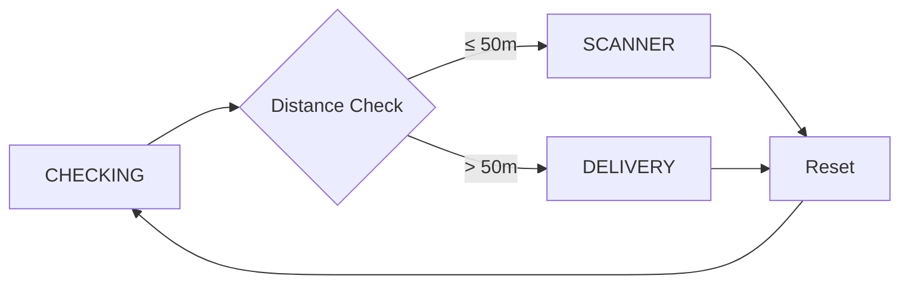

TableOrder uses [Zustand](https://github.com/pmndrs/zustand) for state management. Zustand is a lightweight alternative to Redux that provides the same power with zero boilerplate.

## Why Zustand?

<CardGroup cols={3}>
  <Card title="Zero boilerplate" icon="code">
    No actions, reducers, or providers needed
  </Card>
  <Card title="Selector-based" icon="filter">
    Components only re-render when their specific slice changes
  </Card>
  <Card title="TypeScript-first" icon="shield">
    Full type safety with minimal configuration
  </Card>
</CardGroup>

<Info>
  The three Zustand stores (`useTableStore`, `useCartStore`, `useLocationStore`) manage all session state in approximately 120 lines of code combined.
</Info>

## Store architecture

TableOrder has three independent stores, each managing a specific domain:

```typescript
stores/
├── useTableStore.ts    # Active table session (25 lines)
├── useCartStore.ts     # Cart items, totals, discount (90 lines)
└── useLocationStore.ts # App mode, GPS, delivery info (36 lines)
```

### Store 1: Table store

Manages the active table session after QR code scanning.

**File:** `src/stores/useTableStore.ts`

```typescript
import { create } from 'zustand';
import { TableData } from '@/src/lib/core/types';
import { TABLES_DATA } from '@/src/lib/core/mockData';

interface TableState {
  currentTable: TableData | null;
  isSessionActive: boolean;
  setTable: (id: string) => void;
  clearSession: () => void;
}

export const useTableStore = create<TableState>((set) => ({
  currentTable: null,
  isSessionActive: false,

  setTable: (id: string) => {
    const table = TABLES_DATA[id] ?? null;
    set({ currentTable: table, isSessionActive: table !== null });
  },

  clearSession: () => {
    set({ currentTable: null, isSessionActive: false });
  },
}));
```

<Tabs>
  <Tab title="State shape">
    ```typescript
    {
      currentTable: {
        id: "TABLE_HALL_05",
        displayName: "Salon 05",
        status: "FREE",
        menuType: "FULL",
        specialEvent: "NONE"
      },
      isSessionActive: true
    }
    ```
  </Tab>
  
  <Tab title="Usage">
    ```typescript
    // Read state with selector
    const table = useTableStore((s) => s.currentTable);
    const isActive = useTableStore((s) => s.isSessionActive);
    
    // Update state
    const setTable = useTableStore((s) => s.setTable);
    setTable('TABLE_HALL_05');
    
    // Clear session
    const clearSession = useTableStore((s) => s.clearSession);
    clearSession();
    ```
  </Tab>
</Tabs>

**Key features:**
- Looks up table data from `TABLES_DATA` by ID
- Automatically sets `isSessionActive` based on whether table exists
- Provides `clearSession()` for logout/reset flow

### Store 2: Cart store

Manages shopping cart items, totals, discounts, and service type (table vs delivery).

**File:** `src/stores/useCartStore.ts`

```typescript
import { create } from 'zustand';
import { CartItem, Product } from '@/src/lib/core/types';

interface CartState {
  items: CartItem[];
  isBirthdayMode: boolean;
  discount: number;
  total: number;
  serviceType: 'TABLE' | 'DELIVERY';
  shippingCost: number;
  addItem: (product: Product) => void;
  removeItem: (productId: string) => void;
  resetCart: () => void;
  setBirthdayMode: (active: boolean, discount?: number) => void;
  setServiceType: (type: 'TABLE' | 'DELIVERY') => void;
  setShippingCost: (cost: number) => void;
}

function calcTotal(items: CartItem[], discount: number): number {
  const subtotal = items.reduce(
    (sum, item) => sum + item.product.price * item.quantity,
    0
  );
  return parseFloat((subtotal * (1 - discount)).toFixed(2));
}

export const useCartStore = create<CartState>((set, get) => ({
  items: [],
  isBirthdayMode: false,
  discount: 0,
  total: 0,
  serviceType: 'TABLE',
  shippingCost: 0,

  addItem: (product: Product) => {
    const { items, discount } = get();
    const existing = items.find((i) => i.product.id === product.id);
    const updated = existing
      ? items.map((i) =>
          i.product.id === product.id
            ? { ...i, quantity: i.quantity + 1 }
            : i
        )
      : [...items, { product, quantity: 1 }];

    set({ items: updated, total: calcTotal(updated, discount) });
  },

  removeItem: (productId: string) => {
    const { items, discount } = get();
    const existing = items.find((i) => i.product.id === productId);
    if (!existing) return;

    const updated =
      existing.quantity === 1
        ? items.filter((i) => i.product.id !== productId)
        : items.map((i) =>
            i.product.id === productId
              ? { ...i, quantity: i.quantity - 1 }
              : i
          );

    set({ items: updated, total: calcTotal(updated, discount) });
  },

  resetCart: () => {
    set({
      items: [],
      total: 0,
      isBirthdayMode: false,
      discount: 0,
      serviceType: 'TABLE',
      shippingCost: 0,
    });
  },

  setBirthdayMode: (active: boolean, discount = 0) => {
    const { items } = get();
    set({
      isBirthdayMode: active,
      discount: active ? discount : 0,
      total: calcTotal(items, active ? discount : 0),
    });
  },

  setServiceType: (type) => set({ serviceType: type }),

  setShippingCost: (cost) => set({ shippingCost: cost }),
}));
```

<Note>
  The `calcTotal` helper is defined outside the store to keep the logic pure and testable. It's called automatically whenever items or discount change.
</Note>

**Key features:**

<CardGroup cols={2}>
  <Card title="Smart quantity handling" icon="plus-minus">
    `addItem()` increments quantity if product exists, otherwise adds new item
  </Card>
  <Card title="Auto-remove at zero" icon="trash">
    `removeItem()` removes item from cart when quantity reaches zero
  </Card>
  <Card title="Discount recalculation" icon="percent">
    Total is recalculated whenever items or discount changes
  </Card>
  <Card title="Service type aware" icon="truck">
    Tracks whether order is for table or delivery, affecting shipping cost
  </Card>
</CardGroup>

#### Birthday mode example

When a birthday table is scanned, the menu screen activates birthday mode:

```typescript src/lib/modules/menu/useMenuLogic.ts
useEffect(() => {
  if (!currentTable) return;
  if (currentTable.specialEvent === 'BIRTHDAY') {
    setBirthdayMode(true, currentTable.discount ?? 0);
  } else {
    setBirthdayMode(false, 0);
  }
}, [currentTable?.id]);
```

This triggers:
1. Birthday banner animation
2. 15% discount applied to cart total
3. Automatic recalculation of all prices

### Store 3: Location store

Manages GPS coordinates, app mode (scanner vs delivery), and delivery route information.

**File:** `src/stores/useLocationStore.ts`

```typescript
import { create } from 'zustand';
import { AppMode, Coordinates, DeliveryInfo } from '@/src/lib/core/types';

interface LocationState {
  appMode: AppMode;
  userLocation: Coordinates | null;
  restaurantLocation: Coordinates | null;
  deliveryInfo: DeliveryInfo | null;

  setLocations: (user: Coordinates, restaurant: Coordinates) => void;
  setAppMode: (mode: AppMode) => void;
  setDeliveryRoute: (info: DeliveryInfo) => void;
  resetLocation: () => void;
}

export const useLocationStore = create<LocationState>((set) => ({
  appMode: 'CHECKING',
  userLocation: null,
  restaurantLocation: null,
  deliveryInfo: null,

  setLocations: (user, restaurant) =>
    set({ userLocation: user, restaurantLocation: restaurant }),

  setAppMode: (mode) => set({ appMode: mode }),

  setDeliveryRoute: (info) => set({ deliveryInfo: info }),

  resetLocation: () =>
    set({
      appMode: 'CHECKING',
      restaurantLocation: null,
      deliveryInfo: null,
    }),
}));
```

**App mode flow:**



<Tabs>
  <Tab title="Scanner mode">
    ```typescript
    {
      appMode: 'SCANNER',
      userLocation: { latitude: 40.7128, longitude: -74.0060 },
      restaurantLocation: { latitude: 40.7128, longitude: -74.0060 },
      deliveryInfo: null
    }
    ```
    
    User is within 50m of restaurant. QR scanner is active.
  </Tab>
  
  <Tab title="Delivery mode">
    ```typescript
    {
      appMode: 'DELIVERY',
      userLocation: { latitude: 40.7589, longitude: -73.9851 },
      restaurantLocation: { latitude: 40.7128, longitude: -74.0060 },
      deliveryInfo: {
        distanceKm: 7.42,
        etaMinutes: 18,
        polyline: "...",
        decodedRoute: [{ latitude: ..., longitude: ... }, ...]
      }
    }
    ```
    
    User is outside restaurant radius. Delivery catalog is active with route info.
  </Tab>
</Tabs>

## Store usage patterns

### Selector-based subscriptions

Zustand uses selectors to prevent unnecessary re-renders. Components only update when their specific slice changes.

```typescript
// ❌ Bad: Component re-renders on ANY cart change
const cartState = useCartStore();

// ✅ Good: Only re-renders when total changes
const total = useCartStore((s) => s.total);

// ✅ Good: Only re-renders when item count changes
const itemCount = useCartStore((s) => s.items.length);
```

### Derived state

Compute derived values in selectors rather than storing them:

```typescript
// ✅ Derive subtotal from items
const subtotal = useCartStore((s) => 
  s.items.reduce((sum, item) => sum + item.product.price * item.quantity, 0)
);

// ✅ Derive final total including shipping
const finalTotal = useCartStore((s) => s.total + s.shippingCost);
```

### Multiple selectors

Access multiple values with separate selectors:

```typescript
function CheckoutScreen() {
  const items = useCartStore((s) => s.items);
  const total = useCartStore((s) => s.total);
  const discount = useCartStore((s) => s.discount);
  const serviceType = useCartStore((s) => s.serviceType);
  const shippingCost = useCartStore((s) => s.shippingCost);
  
  // Component only re-renders when these specific values change
}
```

### Actions pattern

Extract actions separately for cleaner code:

```typescript
function ProductCard({ product }: { product: Product }) {
  // Read state
  const cartItems = useCartStore((s) => s.items);
  const currentItem = cartItems.find((i) => i.product.id === product.id);
  
  // Extract actions
  const addItem = useCartStore((s) => s.addItem);
  const removeItem = useCartStore((s) => s.removeItem);
  
  return (
    <View>
      <Text>{product.name}</Text>
      <Button onPress={() => addItem(product)}>Add</Button>
      {currentItem && (
        <Button onPress={() => removeItem(product.id)}>Remove</Button>
      )}
    </View>
  );
}
```

## State coordination

Multiple stores work together through component orchestration:

```typescript src/lib/modules/menu/useMenuLogic.ts
export function useMenuLogic() {
  const currentTable = useTableStore((s) => s.currentTable);
  const setBirthdayMode = useCartStore((s) => s.setBirthdayMode);
  
  // Coordinate table state → cart state
  useEffect(() => {
    if (!currentTable) return;
    if (currentTable.specialEvent === 'BIRTHDAY') {
      setBirthdayMode(true, currentTable.discount ?? 0);
    } else {
      setBirthdayMode(false, 0);
    }
  }, [currentTable?.id]);
  
  // Filter products based on table's menu type
  const products = currentTable?.menuType === 'DRINKS_ONLY'
    ? PRODUCTS.filter((p) => p.category === 'DRINK')
    : PRODUCTS;
  
  return { table: currentTable, products };
}
```

<Info>
  Stores remain independent, but components can read from multiple stores and coordinate updates through effects and callbacks.
</Info>

## Persistence

Currently, TableOrder does not persist state between app restarts. This is intentional — each session starts fresh after scanning a QR code or selecting a restaurant.

To add persistence, Zustand provides a middleware:

```typescript
import { create } from 'zustand';
import { persist, createJSONStorage } from 'zustand/middleware';
import AsyncStorage from '@react-native-async-storage/async-storage';

export const useCartStore = create(
  persist(
    (set, get) => ({
      // ... store definition
    }),
    {
      name: 'cart-storage',
      storage: createJSONStorage(() => AsyncStorage),
    }
  )
);
```

## Next steps

<CardGroup cols={2}>
  <Card title="Architecture overview" icon="sitemap" href="/architecture/overview">
    Understand the overall system design
  </Card>
  <Card title="Services" icon="server" href="/architecture/services">
    Learn about external API integrations
  </Card>
</CardGroup>
