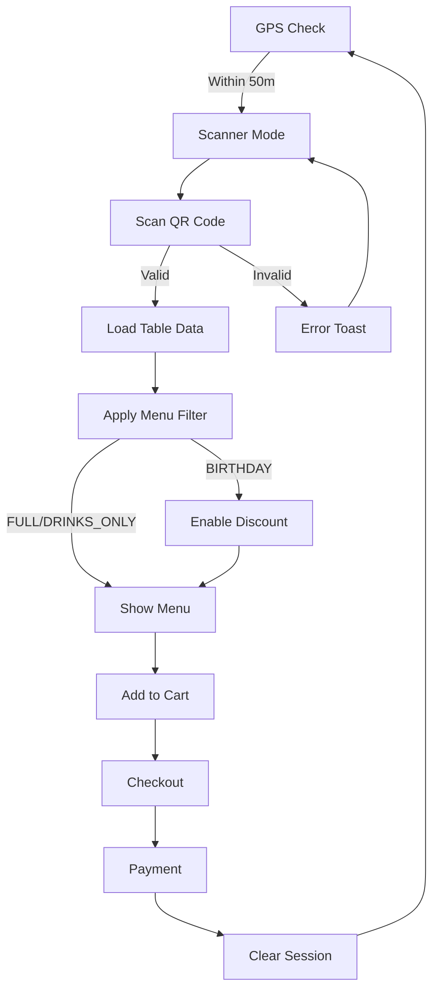

Table mode activates automatically when a customer is within the restaurant's geofence radius (50 meters by default). Customers scan a QR code at their table to start an ordering session with a menu tailored to their table type.

## How it works

<Steps>
  <Step title="GPS geofencing detection">
    The app uses the Haversine formula to calculate the distance between the user's GPS coordinates and the restaurant location:

    ```typescript src/components/location/ContextSwitcher.tsx
    function calculateDistance(c1: Coordinates, c2: Coordinates): number {
      const R = 6_371_000;
      const φ1 = (c1.latitude * Math.PI) / 180;
      const φ2 = (c2.latitude * Math.PI) / 180;
      const Δφ = ((c2.latitude - c1.latitude) * Math.PI) / 180;
      const Δλ = ((c2.longitude - c1.longitude) * Math.PI) / 180;
      const a =
        Math.sin(Δφ / 2) ** 2 +
        Math.cos(φ1) * Math.cos(φ2) * Math.sin(Δλ / 2) ** 2;
      return R * 2 * Math.atan2(Math.sqrt(a), Math.sqrt(1 - a));
    }
    ```

    If the distance is ≤ 50 meters, the app switches to `SCANNER` mode.
  </Step>

  <Step title="QR code scanning">
    The camera activates and displays a branded overlay with an animated scan frame. See [QR Scanner](/features/qr-scanner) for details.
  </Step>

  <Step title="Table session initialization">
    When a valid QR code is scanned, the app:
    - Validates the table ID against the `TABLES_DATA` registry (src/lib/core/mockData.ts:9)
    - Stores the active table in `useTableStore` (src/stores/useTableStore.ts:10)
    - Triggers multimodal feedback (haptic + sound)
    - Navigates to the menu screen
  </Step>

  <Step title="Contextual menu display">
    The menu filters products based on the table's `menuType`. See [Contextual Menus](/features/contextual-menus) for details.
  </Step>
</Steps>

## Table types

Tables are configured with a `menuType` property that determines which products are visible:

<Tabs>
  <Tab title="Full menu">
    Tables with `menuType: 'FULL'` display all product categories:
    - Food
    - Snacks
    - Drinks
    - Desserts

    ```typescript
    {
      id: 'TABLE_HALL_05',
      displayName: 'Salon 05',
      menuType: 'FULL',
      status: 'FREE',
      specialEvent: 'NONE'
    }
    ```
  </Tab>

  <Tab title="Drinks only">
    Bar tables with `menuType: 'DRINKS_ONLY'` show only beverages:

    ```typescript src/lib/modules/menu/useMenuLogic.ts
    const products: Product[] =
      currentTable?.menuType === 'DRINKS_ONLY'
        ? PRODUCTS.filter((p) => p.category === 'DRINK')
        : PRODUCTS;
    ```

    Example configuration:
    ```typescript
    {
      id: 'TABLE_BAR_01',
      displayName: 'Barra 01',
      menuType: 'DRINKS_ONLY',
      status: 'FREE',
      specialEvent: 'NONE'
    }
    ```
  </Tab>

  <Tab title="Birthday table">
    Special event tables with `specialEvent: 'BIRTHDAY'` trigger:
    - Animated cake banner
    - Automatic discount (15% by default)
    - Full menu access

    ```typescript
    {
      id: 'TABLE_BDAY_99',
      displayName: 'Mesa Especial',
      menuType: 'FULL',
      status: 'FREE',
      specialEvent: 'BIRTHDAY',
      discount: 0.15,
      animation: 'cake'
    }
    ```

    The discount is automatically applied in the cart total calculation (src/stores/useCartStore.ts:19).
  </Tab>
</Tabs>

## State management

Table mode uses three Zustand stores:

### Location store

```typescript src/stores/useLocationStore.ts
interface LocationState {
  appMode: AppMode;              // 'CHECKING' | 'SCANNER' | 'DELIVERY'
  userLocation: Coordinates | null;
  restaurantLocation: Coordinates | null;
  setAppMode: (mode: AppMode) => void;
}
```

When geofencing detects the user is within range (src/components/location/ContextSwitcher.tsx:84):
```typescript
if (distanceMeters <= Config.restaurant.geofenceRadiusMeters) {
  setAppMode('SCANNER');
  setServiceType('TABLE');
}
```

### Table store

Manages the active table session:
```typescript
const setTable = useTableStore((s) => s.setTable);
setTable(data); // stores TableData object
```

### Cart store

Handles orders and birthday discounts:
```typescript src/stores/useCartStore.ts
setBirthdayMode: (active: boolean, discount = 0) => {
  const { items } = get();
  set({
    isBirthdayMode: active,
    discount: active ? discount : 0,
    total: calcTotal(items, active ? discount : 0),
  });
}
```

<Info>
The birthday discount is applied immediately when the table is scanned (src/lib/modules/menu/useMenuLogic.ts:22), not at checkout.
</Info>

## QR code format

Table QR codes must match the format `TABLE_*` to be recognized. Test codes:

| QR Code | Table | Menu Type | Special Event |
|---------|-------|-----------|---------------|
| `TABLE_BAR_01` | Barra 01 | Drinks only | None |
| `TABLE_HALL_05` | Salon 05 | Full menu | None |
| `TABLE_BDAY_99` | Mesa Especial | Full menu | Birthday (15% off) |

<Warning>
QR codes that don't exist in `TABLES_DATA` trigger an error toast and reset the scanner to idle state (src/components/scanner/CameraScanner.tsx:60).
</Warning>

## Session lifecycle



The session is cleared after successful payment (src/app/(checkout)/payment.tsx:252):
```typescript
clearSession();  // resets useTableStore
resetLocation(); // resets useLocationStore
resetCart();     // resets useCartStore
```

## Related features

<CardGroup cols={2}>
  <Card title="QR Scanner" icon="qrcode" href="/features/qr-scanner">
    Camera-based QR code scanning with idempotency guards
  </Card>
  <Card title="Contextual Menus" icon="utensils" href="/features/contextual-menus">
    Dynamic menu filtering by table type
  </Card>
  <Card title="Payments" icon="credit-card" href="/features/payments">
    Checkout flow and payment processing
  </Card>
  <Card title="Delivery Mode" icon="truck" href="/features/delivery-mode">
    Alternative mode for customers outside the geofence
  </Card>
</CardGroup>