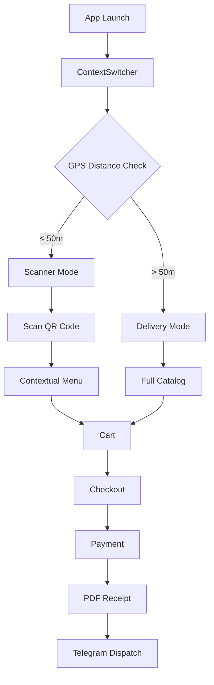

## What is TableOrder?

TableOrder is a full-stack mobile ordering system for restaurants, built with React Native and Expo. It operates in two distinct modes determined automatically by GPS:

- **Table mode** — Customer is inside the restaurant. They scan a QR code at their table, browse a context-aware menu, and pay directly from their phone.
- **Delivery mode** — Customer is outside the restaurant. They tap the restaurant on a live map, browse the full menu, and checkout with calculated shipping cost and real-time route tracking.

The app adapts its interface at every level: a bar table shows a drinks-only menu, a full dining table shows all categories, and a birthday table triggers a festive animation with an automatic discount.

<CardGroup cols={2}>
  <Card
    title="Quick start"
    icon="rocket"
    href="/quickstart"
  >
    Get TableOrder running in under 5 minutes
  </Card>
  <Card
    title="Installation"
    icon="download"
    href="/installation"
  >
    Complete setup guide with prerequisites and environment configuration
  </Card>
  <Card
    title="Architecture"
    icon="diagram-project"
    href="/architecture/overview"
  >
    Learn about the feature-based structure and tech stack
  </Card>
  <Card
    title="API reference"
    icon="code"
    href="/api/stores/cart-store"
  >
    Explore services, stores, and core utilities
  </Card>
</CardGroup>

## Key features

<CardGroup cols={3}>
  <Card title="GPS geofencing" icon="location-dot">
    Haversine-based context detection automatically switches between table and delivery modes
  </Card>
  <Card title="QR scanner" icon="qrcode">
    Idempotency-guarded camera scanner with branded overlay and haptic feedback
  </Card>
  <Card title="Contextual menus" icon="utensils">
    Menu content filtered by table type (full menu vs. drinks only)
  </Card>
  <Card title="Birthday mode" icon="cake-candles">
    Animated banner with automatic discount applied to cart total
  </Card>
  <Card title="Route tracking" icon="route">
    Post-payment Mapbox map showing driving route, ETA, and distance
  </Card>
  <Card title="PDF receipts" icon="receipt">
    Branded PDF tickets auto-generated after every successful payment
  </Card>
  <Card title="Telegram dispatch" icon="telegram">
    PDF receipts sent silently to a Telegram chat via Bot API
  </Card>
  <Card title="Stripe payments" icon="credit-card">
    Full payment flow with card preview and failure states
  </Card>
  <Card title="Dark mode" icon="moon">
    Full dark-first design using the Expo Colors system
  </Card>
</CardGroup>

## How it works

<Note>
  TableOrder uses GPS-based geofencing with a configurable radius (default: 50 meters) to determine whether a customer is dining in or ordering delivery.
</Note>

## Tech stack

TableOrder is built with modern React Native technologies:

| Layer | Technology |
|-------|------------|
| Framework | React Native 0.83 + Expo SDK 55 |
| Navigation | Expo Router (file-based) |
| State | Zustand 5 |
| Payments | Stripe React Native SDK |
| Maps | @rnmapbox/maps (Mapbox GL) |
| Location | expo-location (GPS + geofencing) |
| Camera | expo-camera |
| Animations | react-native-reanimated 4 |
| Notifications | expo-notifications |
| PDF | expo-print |
| Language | TypeScript (strict mode) |

## Use cases

<AccordionGroup>
  <Accordion title="Quick-service restaurant">
    Customer scans table QR code, orders without calling staff, and pays in seconds. Perfect for busy lunch rushes or self-service concepts.
  </Accordion>
  
  <Accordion title="Bar or lounge">
    Bar QR code shows drinks-only menu, automatically blocking food items. Keeps the interface focused and prevents ordering confusion.
  </Accordion>
  
  <Accordion title="Birthday celebration">
    Special table QR activates animated banner and 15% discount on the total. Creates a memorable experience for special occasions.
  </Accordion>
  
  <Accordion title="Restaurant with delivery">
    Customer outside the geofence taps the restaurant on a map, sees full menu, and gets real driving route and ETA after payment.
  </Accordion>
  
  <Accordion title="Operator receipts">
    Every payment auto-generates a PDF and pushes it to a Telegram channel for back-office tracking. No manual receipt management needed.
  </Accordion>
</AccordionGroup>

## App modes explained

TableOrder automatically switches between two modes based on your GPS location:

### Scanner mode (in-restaurant)

When you're within 50 meters of the restaurant:
- QR scanner activates
- Scan table code to see contextual menu
- Menu adapts to table type (bar, dining, birthday)
- Fast checkout without shipping costs

### Delivery mode (remote)

When you're farther than 50 meters:
- Interactive map shows restaurant location
- Browse full menu catalog
- Shipping cost calculated per kilometer
- Post-payment route tracking with ETA

<Tip>
  The geofence radius is configurable in `src/lib/core/config.ts`. Adjust it based on your restaurant's physical layout.
</Tip>

## Next steps

<CardGroup cols={2}>
  <Card
    title="Install TableOrder"
    icon="download"
    href="/installation"
  >
    Set up your development environment and configure API keys
  </Card>
  <Card
    title="Quick start guide"
    icon="play"
    href="/quickstart"
  >
    Get the app running and test both modes in under 5 minutes
  </Card>
</CardGroup>
